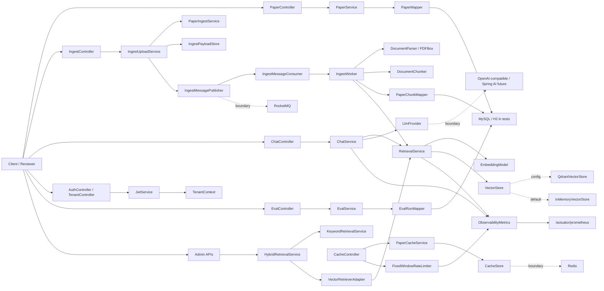

# Cite Scope Java Backend Architecture Overview

> Review target: `/Users/wesz_station/Projects/PaperRAG/java-backend`
>
> Scope: 这是基于 `paperrag_java_learning_roadmap_html.html` 推进出的 Java/Spring Boot 后端迭代版本。它不是对现有 Python/FastAPI 后端的逐行翻译，而是用 Java 后端工程边界重新实现 Cite Scope 的核心能力。

## 1. 当前结论

Cite Scope Java backend 当前已经形成一个可运行、可测试的后端雏形：

- 已完成 Spring Boot 基础骨架、统一响应、异常处理、traceId、配置绑定。
- 已完成 MyBatis-Plus + SQL schema + paper/chunk/task/eval 相关持久化。
- 已完成上传、解析、分块、向量索引、检索、最小 RAG 问答和 SSE 流式输出。
- 已完成 JWT 登录、多租户上下文、tenant 级访问隔离测试。
- 已完成缓存抽象、Redis 配置边界、空值缓存、TTL jitter、固定窗口限流。
- 已完成 ingest 消息发布/消费抽象、RocketMQ 配置边界、失败记录、admin retry。
- 已完成 keyword/vector/hybrid 检索、RRF 融合、vector 降级路径。
- 已完成 Actuator health、Prometheus scrape、Micrometer 自定义指标。
- 已完成 Recall@K、MRR、NDCG@K 评估指标和 `eval_runs` 持久化。

当前还没有完成真实生产外部系统接入：Redis、RocketMQ、Qdrant、真实 LLM、Sentinel、Grafana、Gatling/JMeter 压测都还是 Java 边界或文档级 follow-up，不应在 review 时误认为已经接入真实集群。

## 2. 技术栈

| 层 | 当前实现 |
|---|---|
| Runtime | Java 21 |
| Framework | Spring Boot 3.3.5 |
| Web | Spring MVC, Validation, SSE via `StreamingResponseBody` |
| Security | Spring Security 6, BCrypt, lightweight HMAC JWT |
| ORM | MyBatis-Plus 3.5.9 |
| SQL | MySQL runtime driver, H2 test database |
| PDF | PDFBox 3.0.3 |
| Vector | `VectorStore` abstraction, in-memory default, Qdrant REST adapter |
| Cache | `CacheStore` abstraction, in-memory default, Redis config boundary |
| MQ | `IngestMessagePublisher` abstraction, in-memory default, RocketMQ config boundary |
| Observability | TraceId filter, Actuator, Micrometer, Prometheus registry |
| Test | JUnit 5, MockMvc, H2, mocked HTTP, deterministic local providers |

## 3. Package Map

```text
java-backend/src/main/java/com/wesz/paperrag/
├── auth/             # 登录、JWT、租户上下文、tenant API
├── cache/            # cache-aside、空值缓存、TTL jitter、限流
├── chat/             # 最小 RAG chat、SSE、LLM provider 边界
├── chunk/            # paper_chunks entity/mapper
├── common/           # ApiResponse、BusinessException、全局异常
├── config/           # Async、MyBatis-Plus、配置属性
├── eval/             # eval_runs、Recall/MRR/NDCG、eval API
├── health/           # health API
├── hybrid/           # BM25-style keyword、vector adapter、RRF hybrid
├── ingest/           # upload、parse、chunk、task state、message boundary、retry
├── observability/    # Micrometer metrics、Prometheus scrape
├── paper/            # Paper CRUD、MyBatis service、raw JDBC comparison
├── vector/           # EmbeddingModel、VectorStore、Qdrant/in-memory implementations
└── web/              # traceId filter
```

## 4. High-Level Architecture



## 5. Core Runtime Flows

### 5.1 Paper CRUD

1. `PaperController` 接收创建、查询、分页、更新、删除请求。
2. `MyBatisPaperService` 负责业务行为。
3. `PaperPersistenceService` / `PaperMapper` 访问 `papers` 表。
4. `GlobalExceptionHandler` 统一转换 validation、business、unexpected errors。

完成状态：已完成，含 MockMvc 与持久化测试。

### 5.2 Upload -> Ingest -> Chunk -> Vector Index

1. `POST /api/ingest/upload` 接收文件。
2. `IngestUploadService` 读取 bytes，计算 `sha256(file)` 作为 `bizKey`。
3. `PaperIngestService` 事务性创建 `papers` 与 `ingest_tasks`。
4. payload 存入 `IngestPayloadStore`。
5. `IngestMessagePublisher` 发布 `IngestMessage`。
6. 默认 `InMemoryIngestMessagePublisher` 立即消费消息。
7. `IngestWorker` 执行状态流转：

```text
PENDING -> PARSING -> EMBEDDING -> DONE
                         |
                         v
                       FAILED
```

8. worker 使用 `DocumentParser` 解析文本/PDF，`DocumentChunker` 分块，`PaperChunkMapper` 写入 `paper_chunks`。
9. worker 调用 `RetrievalService.indexChunks()` 写入向量存储。

完成状态：本地 message boundary 已完成；真实 RocketMQ consumer restart、DLQ、reconsumeTimes 还未完成。

### 5.3 Retrieval And Minimal RAG

1. `POST /api/chat` 或 `/api/chat/stream` 接收 question。
2. `ChatService` 调用 `RetrievalService.search(question, 5)`。
3. `RetrievalService` 使用 `EmbeddingModel` 生成 query vector。
4. `VectorStore` 返回 topK chunk。
5. `LlmProvider` 基于 question + sources 生成回答。
6. SSE 版本先发 sources，再发 token，最后发 done。

完成状态：最小 RAG 和 SSE 已完成；真实 Spring AI `ChatClient`、真实流式 LLM token bridge 还未完成。

### 5.4 Auth And Tenant Isolation

1. `POST /api/auth/login` 使用内存用户表验证账号密码。
2. `AuthService` 签发 HMAC JWT。
3. `JwtAuthenticationFilter` 解析 token，写入 Spring Security context。
4. `TenantContext` 保存当前 tenant。
5. `/api/tenant/**` 受保护，跨 tenant paper 访问返回 403。

完成状态：JWT 与 tenant API 测试已完成；数据库级全局 tenant interceptor、所有表/所有 API 的完整 tenant filter 还未完成。

### 5.5 Cache And Rate Limit

1. `GET /api/cache/papers/{id}` 走 `PaperCacheService`。
2. 先查 `CacheStore`，命中则返回 `cacheHit=true`。
3. 未命中查 DB，写入缓存，TTL 可配置并带 jitter。
4. missing paper 会写入 null cache，短 TTL 防止缓存穿透。
5. `GET /api/cache/rate-limited-ping` 使用 `FixedWindowRateLimiter`。

完成状态：cache abstraction、null caching、TTL jitter、fixed window limiter 已完成；真实 Redis、Redisson lock、Lua script、sliding window/token bucket 还未完成。

### 5.6 Hybrid Retrieval

1. `GET /api/admin/eval/hybrid` 接收 query、topK、mode、degradeVector。
2. `KeywordRetrievalService` 对 `paper_chunks.content` 做 BM25-style 本地评分。
3. `VectorRetrieverAdapter` 复用 `RetrievalService` 做 vector recall。
4. `HybridRetrievalService` 用 RRF 融合 keyword/vector ranking。
5. 当 vector path 失败或 `degradeVector=true` 时，降级为 keyword-only。

完成状态：keyword-only、vector-only、hybrid、degradation 已完成；MySQL FULLTEXT/ngram、并行 CompletableFuture timeout、alpha/min-max tuning 还未完成。

### 5.7 Observability

1. `TraceIdFilter` 为请求生成或透传 `X-Trace-Id`。
2. `ObservabilityMetrics` 记录：
   - `paperrag_chat_requests_total`
   - `paperrag_retrieval_search_seconds_count`
   - `paperrag_rate_limit_requests_total`
3. `/actuator/health` 提供健康检查。
4. `/actuator/prometheus` 输出 Prometheus text scrape。

完成状态：基础 metrics 和 scrape 已完成；Grafana dashboard、MQ trace propagation、Sentinel dashboard、LLM token cost 指标还未完成。

### 5.8 Evaluation

1. `POST /api/eval/run` 接收 ground truth chunk ids、retrieved chunk ids、K。
2. `EvalMetrics` 计算 Recall@K、MRR、NDCG@K。
3. `EvalService` 持久化 `eval_runs`。
4. `GET /api/eval/runs/{runId}` 查询 eval summary。

完成状态：指标计算和持久化已完成；真实 20 papers / 50 queries ground-truth set、nightly eval、faithfulness/answer relevance、JMH/Gatling 报告还未完成。

## 6. API Review Checklist

| Area | Endpoint | Status |
|---|---|---|
| Health | `GET /api/health` | 已完成 |
| Paper CRUD | `POST /api/papers`, `GET /api/papers/{id}`, `GET /api/papers/page` | 已完成 |
| Ingest | `POST /api/ingest/upload`, `GET /api/ingest/tasks/{taskId}` | 已完成 |
| Chat | `POST /api/chat` | 已完成 |
| SSE | `POST /api/chat/stream` | 已完成 |
| Auth | `POST /api/auth/login` | 已完成 |
| Tenant | `GET /api/tenant/me`, `GET /api/tenant/papers/{id}` | 已完成 |
| Cache | `GET /api/cache/papers/{id}` | 已完成 |
| Rate Limit | `GET /api/cache/rate-limited-ping` | 已完成 |
| Ingest Admin | `GET /api/admin/ingest/messages`, `POST /api/admin/ingest/tasks/{taskId}/retry` | 已完成 |
| Hybrid Eval | `GET /api/admin/eval/hybrid` | 已完成 |
| Eval | `POST /api/eval/run`, `GET /api/eval/runs/{runId}` | 已完成 |
| Observability | `GET /actuator/health`, `GET /actuator/prometheus` | 已完成 |

## 7. Roadmap Completion Matrix

| Week | Roadmap Goal | Current Status | Notes |
|---|---|---|---|
| W1 | Spring Boot foundation | 已完成 | health、CRUD、统一响应、异常、traceId |
| W2 | MySQL + MyBatis-Plus | 已完成 | Paper/entity/mapper/service、分页、事务、索引说明、raw JDBC comparison |
| W3 | Upload + PDF parsing + async state machine | 已完成 | PDFBox、chunker、`IngestWorker`、task status |
| W4 | Embedding + Qdrant boundary | 已完成 | deterministic embedding、`VectorStore`、in-memory default、Qdrant REST adapter |
| W5 | Minimal RAG + SSE | 已完成 | `/api/chat`、`/api/chat/stream`、sources/token/done |
| W6 | User system + JWT + multi-tenancy | 已完成一层 | JWT 和 tenant API 完成；全局 tenant interceptor 未完成 |
| W7 | Redis caching and cache defenses | 部分完成 | cache abstraction、null cache、TTL jitter 完成；真实 Redis/Redisson/Lua 未完成 |
| W8 | RocketMQ async ingest | 部分完成 | MQ abstraction、admin stats、retry 完成；真实 RocketMQ/DLQ/reconsume 未完成 |
| W9 | Hybrid retrieval | 已完成基础版 | BM25-style local keyword、vector、RRF、degradation 完成；FULLTEXT/parallel timeout 未完成 |
| W10 | Rate limiting + observability | 部分完成 | custom limiter、traceId、Micrometer、Prometheus 完成；Sentinel/Grafana 未完成 |
| W11 | Evaluation + load testing | 部分完成 | Recall/MRR/NDCG 和 eval_runs 完成；真实 eval set/load test 未完成 |
| W12 | Portfolio packaging | 已收敛 | 分散中间文档已删除，保留本总览文档 |

## 8. Explicitly Unfinished Work

### Production External Systems

- 未接入真实 Redis 7；当前是 `CacheStore` + `InMemoryCacheStore`。
- 未接入真实 RocketMQ；当前是 `IngestMessagePublisher` + `InMemoryIngestMessagePublisher`。
- 未在默认测试中调用真实 Qdrant；当前默认是 `InMemoryVectorStore`，Qdrant 只有 REST adapter 和 mocked contract test。
- 未接入真实 LLM 或 Spring AI；当前是 `LlmProvider` + `DeterministicLlmProvider`。
- 未接入 Sentinel Dashboard；当前只有自研 fixed-window limiter。

### Retrieval And Agent Depth

- 未实现 Python 版 LangGraph agent 的 intent/planner/executor/reflection/re-planner 完整链路。
- 未实现 multi-step agent tool dispatch。
- 未实现 citation faithfulness/completeness/logic reflection。
- 未实现 arXiv/web search tools。
- 未实现 paper detail/chunk tool 的 agent 化调用。

### Production Hardening

- 未加 Flyway/Liquibase migration。
- 未加真实 secrets 管理。
- 未加完整 RBAC。
- 未加全 API tenant isolation interceptor。
- 未加分布式锁。
- 未加 dead-letter queue 处理。
- 未加 Docker compose 或部署脚本。

### Evaluation And Load Testing

- 未构建 20 papers / 50 queries ground-truth dataset。
- 未跑 Gatling/JMeter 100 并发 5 分钟。
- 未产出 P50/P95 真实性能数字。
- 未实现 faithfulness / answer relevance 自动评分。
- 未实现 nightly eval scheduler。

## 9. Test Coverage Snapshot

当前测试文件覆盖以下行为：

- Health: `HealthControllerTest`
- Paper CRUD/persistence/raw JDBC: `PaperControllerTest`, `PaperPersistenceServiceTest`, `RawJdbcPaperMapperTest`
- Chunk/ingest/parser/message: `PaperChunkMapperTest`, `DocumentParserTest`, `DocumentChunkerTest`, `IngestControllerTest`, `IngestMessageAdminControllerTest`, `PaperIngestServiceTest`
- Vector/Retrieval/Qdrant: `HashingEmbeddingModelTest`, `InMemoryVectorStoreTest`, `QdrantVectorStoreTest`, `RetrievalControllerTest`
- Chat/SSE: `ChatControllerTest`
- Auth/Tenant: `AuthTenantControllerTest`
- Cache/Rate limit: `CacheAndRateLimitControllerTest`
- Hybrid retrieval: `HybridRetrievalControllerTest`
- Observability: `ObservabilityControllerTest`
- Eval: `EvalMetricsTest`, `EvalControllerTest`
- TraceId/config: `TraceIdFilterTest`, `PaperPropertiesTest`

最近一次全量验证：

```text
Command: mvn test
Result: Tests run: 40, Failures: 0, Errors: 0, Skipped: 0
Date: 2026-06-02
```

## 10. Suggested Review Order

1. 先看 `java-backend/pom.xml`，确认依赖边界。
2. 看 `common/`、`web/`、`config/`，理解基础工程骨架。
3. 看 `paper/`、`chunk/`、`ingest/`，理解数据模型和上传处理主链路。
4. 看 `vector/`、`chat/`、`hybrid/`，理解 RAG 与检索能力。
5. 看 `auth/`、`cache/`、`observability/`、`eval/`，理解产品化能力。
6. 最后看 `src/test/java/...`，用测试反推每个模块真实完成程度。

## 11. Main Review Questions

- Java backend 是否应该继续保留在独立 `java-backend/`，还是开始和 Cite Scope backend/frontend 设计集成边界？
- 下一步优先补真实外部系统接入，还是补完整 agent graph 能力？
- tenant isolation 是先做 MyBatis interceptor，还是先限制在核心业务 service 内？
- hybrid retrieval 下一步是否应该落 MySQL FULLTEXT/ngram，还是直接引入 Lucene/Elasticsearch？
- eval 下一步是否优先做真实 ground-truth dataset，还是先做 load testing harness？
